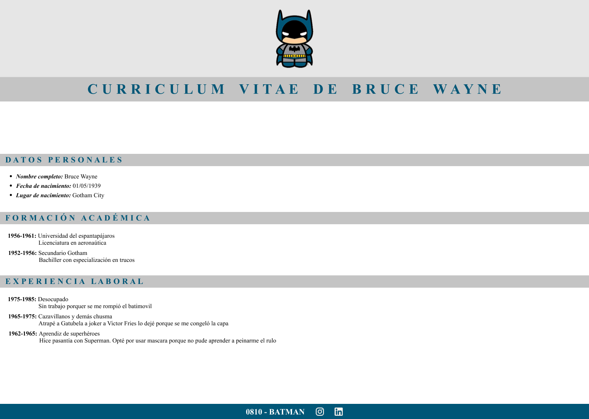

# Práctica 16 - Frontend I

Tomando guía el trabajo CV-Batman de la clase 7, crearemos esos estilos nuevamente utilizando el preprocesador Sass, visto en esta clase. Tené en cuenta renombrar tu CSS anterior para no  perderlo.  

Una vez completada la actividad, compartir el enlace de GitHub Pages en el canal general de Discord.

Diseño de la práctica realizada en la clase C5S:

